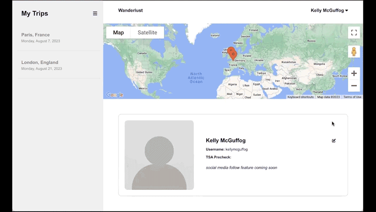
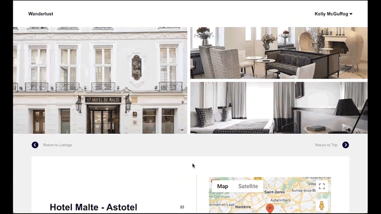
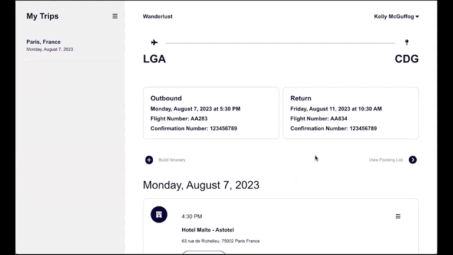
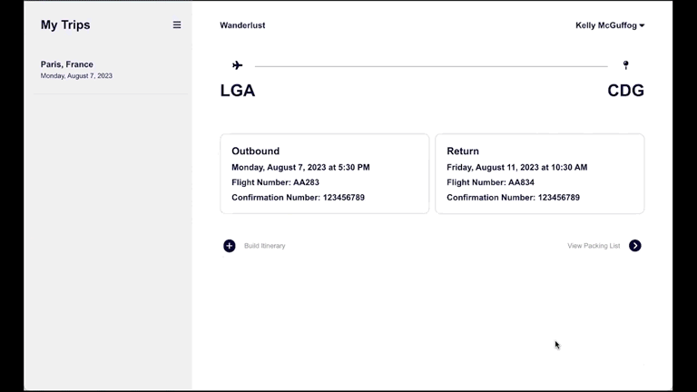

## Description

Wanderlust: Travel the world with ease and make the most of your adventures. Build itineraries, manage packing lists, and share your travel information with friends and family.

## Requirements

* Ruby 2.7.4
* NodeJS (v16) and npm
* Homebrew

## Setup

To run this application locally on your machine, follow these steps:

1. Fork and clone the repository to your local machine using Git:

```console
$ git clone git@github.com:your-username/capstone-project.git
```


2. Navigate to the project directory:

```console
$ cd capstone-project
```


3. Set up the frontend and backend dependencies from the root directory:

```console
$ npm install --prefix client
$ bundle install
$ rails db:migrate db:seed
```


4. Run the Rails application in one terminal:

```console
$ rails s
```


5. Then, **open another terminal** and run React:

```console
$ npm start --prefix client
```

## Demo
<p float="left">







</p>

## MVP

As a user, I can:

* Sign up for an account
* Log in to the site & remain logged in
* Log out
* View a list of all destinations and their respective hotels, restaurants, and activities
* Search a destination, hotel, restaurant, or activity by name
* Filter hotels by price and rating
* Filter restaurants by price, rating, and cuisine
* Filter activities by price, duration, and rating
* View details about a hotel, restaurant, or activity
* View the location of the hotel, restaurant, or activity on a map
* Create a trip
* Delete a trip
* Modify a trip's details
* View my trip's details, itinerary, and packing list
* View my trip locations on a map
* Create an itinerary day and time for a hotel, restaurant, or activity and add it to my trip
* Modify an itinerary day and time for a hotel, restaurant, or activity
* Delete an itinerary day and time and its respective hotel, restaurant, or activity from my trip
* View 3 users who also have a specific hotel, restaurant, or activity on their trip's itinerary
* Modify my profile information
* Create a packing list for my trip
* Mark an item as packed on my packing list
* Delete an item from my packing list
* Resize the application for any screen


## Roadmap

* As of August 2023, seed data is only available for Paris. More data will be available soon.
* Social media feature coming soon.


## Resources

* [TripAdvisor](https://www.tripadvisor.com/)
* Google Maps API
* FontAwesome
